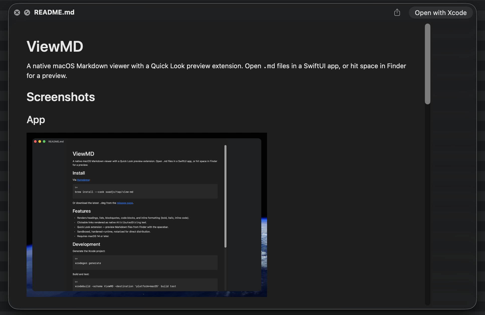

# ViewMD

A native macOS Markdown viewer with a Quick Look preview extension. Open `.md` files in a SwiftUI app, or hit space in Finder for a preview.

## Screenshots

| App | Quick Look |
| --- | --- |
|  |  |

## Install

Via [Homebrew](https://brew.sh):

```sh
brew install --cask saadjs/tap/view-md
```

Or download the latest `.dmg` from the [releases page](https://github.com/saadjs/view-md/releases).

## Features

- Renders headings, lists, blockquotes, code blocks, and inline formatting (bold, italic, inline code).
- Clickable links rendered as native `AttributedString` text.
- Remote images (PNG/JPG/GIF/SVG) — including shields.io-style SVG badges.
- Quick Look extension — preview Markdown files from Finder with the spacebar.
- Sandboxed, hardened-runtime, notarized for direct distribution.
- Requires macOS 14 or later.

## How It Works

ViewMD renders Markdown locally in a native SwiftUI app and through its bundled Quick Look extension. It follows standard macOS security practices for distributed apps, including hardened runtime, notarization, and scoped file access.

The app does not collect analytics, telemetry, or document contents. Markdown files are read on your Mac for display. Remote image URLs in a document may be fetched so they can be shown in the preview.

For local images referenced from Markdown, ViewMD only reads files it can already access. If an image lives outside that access, the app asks you to grant folder access and stores a security-scoped bookmark so future previews can load images from that folder.

## Development

Generate the Xcode project:

```sh
xcodegen generate
```

Build and test:

```sh
xcodebuild -scheme ViewMD -destination 'platform=macOS' build test
```

## Release

```sh
scripts/release.sh <version>
gh release create v<version> build/release/ViewMD-<version>.dmg --title "v<version>" --notes "..."
```

Publishing the release triggers `.github/workflows/update-homebrew-tap.yml`, which updates the cask in [`saadjs/homebrew-tap`](https://github.com/saadjs/homebrew-tap).

## License

MIT — see [LICENSE](LICENSE).
