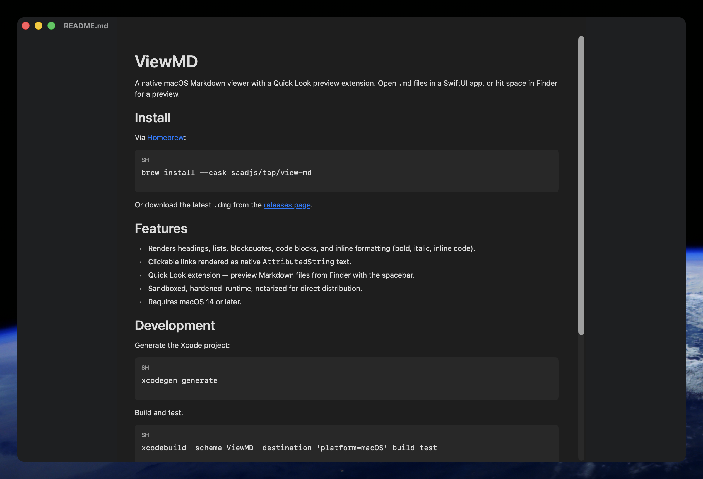
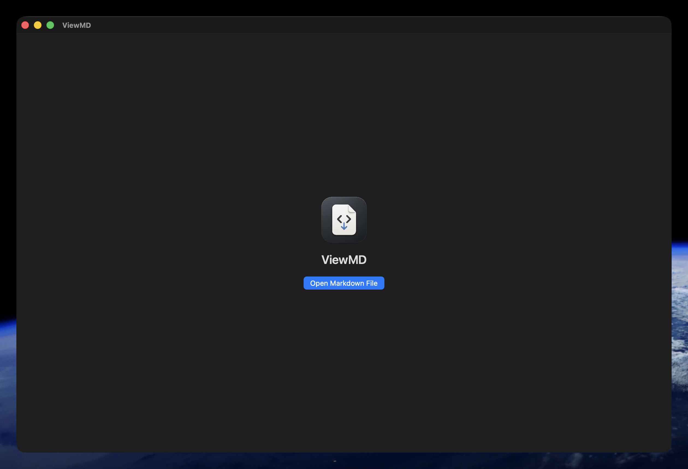

# ViewMD

A native macOS Markdown viewer with a Quick Look preview extension. Open `.md` files in a SwiftUI app, or hit space in Finder for a preview.





## Install

Via [Homebrew](https://brew.sh):

```sh
brew install --cask saadjs/tap/view-md
```

Or download the latest `.dmg` from the [releases page](https://github.com/saadjs/view-md/releases).

## Features

- Renders headings, lists, blockquotes, code blocks, and inline formatting (bold, italic, inline code).
- Clickable links rendered as native `AttributedString` text.
- Remote images (PNG/JPG/GIF/SVG) — including shields.io-style SVG badges.
- Quick Look extension — preview Markdown files from Finder with the spacebar.
- Sandboxed, hardened-runtime, notarized for direct distribution.
- Requires macOS 14 or later.

## Development

Generate the Xcode project:

```sh
xcodegen generate
```

Build and test:

```sh
xcodebuild -scheme ViewMD -destination 'platform=macOS' build test
```

## Release

```sh
scripts/release.sh <version>
gh release create v<version> build/release/ViewMD-<version>.dmg --title "v<version>" --notes "..."
```

Publishing the release triggers `.github/workflows/update-homebrew-tap.yml`, which updates the cask in [`saadjs/homebrew-tap`](https://github.com/saadjs/homebrew-tap).

## License

MIT — see [LICENSE](LICENSE).
